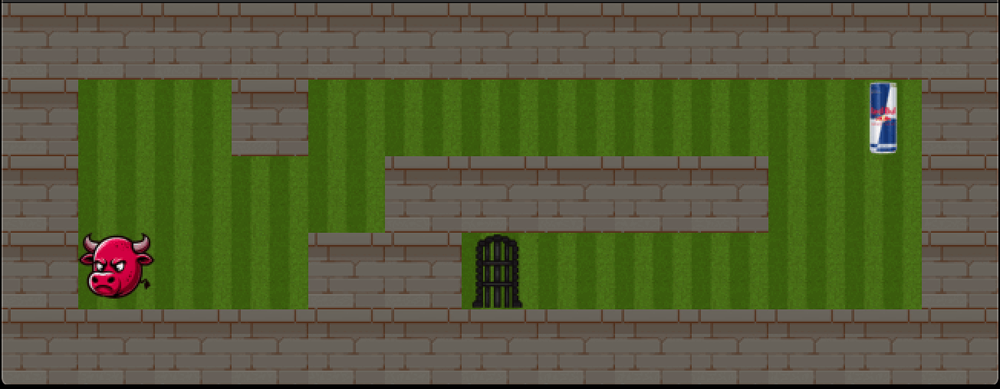

<div align="center">
	
	### so_long
</div>

## Description

This project is part of the 42 school curriculum, showcasing a simple 2D maze game where players navigate a character through a map to collect items and find an exit. The game is developed using the MLX42 library, which is included within the project for rendering.

## Compilation and Execution

This game is designed to run on systems with the MLX42 library configured. Follow these steps to compile and run the game:

1. Clone the repository and navigate to the project directory.
2. Compile the game using `make`:
    ```
    make
    ```
    This generates an executable named `so_long`.
3. To start the game, run:
    ```
    ./so_long path/to/map.ber
    ```
    Ensure you replace `path/to/map.ber` with the path to your game map in `.ber` format.

## Controls

- `W` or `↑`: Move up.
- `A` or `←`: Move left.
- `S` or `↓`: Move down.
- `D` or `→`: Move right.

The goal is to collect all collectibles and proceed through the exit to complete the level.

## Project Code Flow

1. **Initialization**: Sets up the MLX42 window, loads textures for the player, walls, collectibles, and exit, and initializes game state.
2. **Map Parsing**: Reads and validates the `.ber` map file, ensuring correct formatting and the presence of essential elements.
3. **Game Loop**:
    - Responds to player input for movement.
    - Updates the player's position if the move is valid (i.e., not into walls or outside the map).
    - Redraws only the player's previous and new positions to optimize rendering, rather than the entire map.
    - Checks for win conditions: collecting all items and reaching the exit.
4. **Winning Condition**: Displays a congratulatory message upon successful collection and exit, then cleans up resources.
5. **Cleanup**: Frees textures and map data to avoid memory leaks, ensuring a clean exit.

## Efficient Rendering

To optimize performance, the game intelligently updates only parts of the screen that change:
- When the player moves, the game erases the player's previous position and redraws the player at the new location.
- The map remains static unless a collectible is picked up, at which point only the affected tile is updated.
- This approach minimizes redraw calls, enhancing the game's responsiveness and reducing CPU load.

## Gameplay



## Note

This project uses the [MLX42](https://github.com/codam-coding-college/MLX42) library for rendering, which is included with the project. This ensures that the project is self-contained and does not require external dependencies for graphics rendering.
